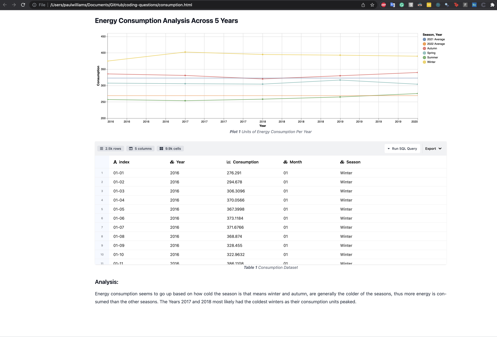
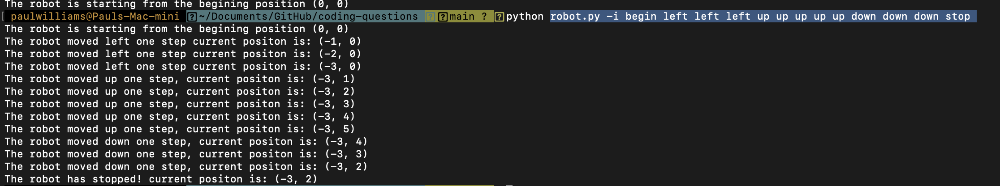

# Coding Assessment Questions

This repo was created to answer a few coding assessment problems. All of my provided answers are in the single [assesment.ipynb](https://github.com/PaulWill92/time_series_assessment/blob/main/assesment.ipynb) file. It is ordered with markdown syntax within the notebook for ease of viewing.

The contents below contain the original scripts I made for each question, in order to make them a little more interactive. You have to run these from the terminal in order to view outputs.

## Contents

1. Q1 - [Merge.py](https://github.com/PaulWill92/time_series_assessment/blob/main/merge.py) - this file is designed as a script to run from a terminal.

2. Q2 - [Consumption.py] - this file is designed as a dashboard to provide both visuals and dataframe changes. You can open the file locally by downloading [consumption.html](./tasks/consumption.html) and opening the file in your web browser. The visuals and tables are interective and allow you to change the viewing scope. You can also perform sql queries on the data source, and download it.

3. Q3 - [robot.py]() - This file is a python script file that executes from the command line. When you pass a list with the `-i` argument the robot executes commands and then tells you it's final position. Example: `python robot.py -i begin left left left up up up up up down down down stop `.

3. Q4 = [trades.py]() - this file also acts as a command line script.

